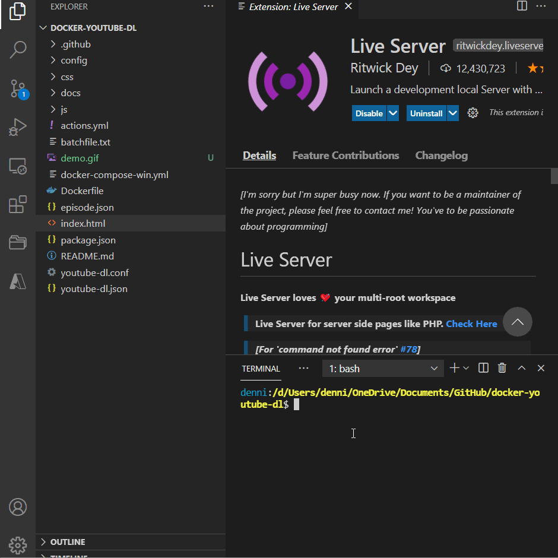

# docker-youtube-dl

Docker starter project for [youtube-dl](https://github.com/ytdl-org/youtube-dl), a command-line program to download videos from [YouTube.com](https://youtube.com)

<!-- TOC -->

- [docker-youtube-dl](#docker-youtube-dl)
  - [TL;DR](#tldr)
  - [About docker-youtube-dl](#about-docker-youtube-dl)
  - [Project Structure](#project-structure)
    - [Environment](#environment)
  - [Docker Usage](#docker-usage)
    - [Build a new Docker Image](#build-a-new-docker-image)
    - [Running a new Docker Container](#running-a-new-docker-container)
    - [Debugging a Docker Container](#debugging-a-docker-container)
    - [Stopping and Deleting the Docker Container](#stopping-and-deleting-the-docker-container)
    - [Stopping and Deleting both the Docker Container and Image](#stopping-and-deleting-both-the-docker-container-and-image)
    - [List all Docker Containers](#list-all-docker-containers)
    - [Remove Docker Image](#remove-docker-image)
    - [Configuration](#configuration)
    - [Reach Out!](#reach-out)
    - [License](#license)

<!-- /TOC -->

## TL;DR

---

## About docker-youtube-dl

**docker-youtube-dl** was a personal project to:

- automate download of YouTube videos
- automate subtitle files creation
- automate metadata files creation

---

## Project Structure

     docker-youtube-dl/               <-- Root of your project
       |- .env                        <-- environment variable file for docker-compose.yml
       |- batchfile.txt               <-- (optional) batch download URLs file for youtube-dl
       |- docker-compose-win.yml      <-- Docker-compose file to manage containers locally
       |- Dockerfile                  <-- Docker image build file inspired by kijart/youtube-dl
       |- index.html                  <-- App page
       |- README.md                   <-- This README markdown file
       |- youtube-dl.conf             <-- configuration file for youtube-dl
       |- youtube-dl.json             <-- JSON file for app page
       +- docs/                       <-- Root of Git Page dennislwm.github.io/docker-youtube-dl/
          |- index.md                 <-- Home page
          +- homily/                  <-- Transcript *.txt files of Archdiocese homily

---

### Environment

Before using _docker-compose_, there are TWO (2) optional and TWO (2) required environment variables that you should set in the _.env_ file:

1. (Optional) BATCH environment variable specifies the file that contains URLs to download, one URL per line. Lines starting with '#', ';' or ']' are considered as comments and ignored.

2. (Optional) AFTER environment variable filters videos by their upload date, in either an absolute date format, i.e. YYYYMMDD, or relative date format, i.e. (now|today)[+-][0-9](day|week|month|year)(s)?

3. (Required) WORKDIR environment variable specifies a path to a download folder for your YouTube videos. This host directory is also mounted to the container directory, i.e. _/media/_.

4. (Required) URL environment variable specifies a URL address for either a video or a playlist.

The environment variables BATCH and URL are mutually exclusive.

If you use BATCH mode, then a file that contains URLs to download should be located in WORKDIR, e.g. \${WORKDIR}/batchfile.txt

Example: _.env_ file for downloading batch URLs in BATCH mode, where _batchfile.txt_ contains one URL per line

      BATCH=--batch-file batchfile.txt
      AFTER=--dateafter 20200220
      URL=
      PATH=d:\docker\youtube-dl

Example: _.env_ file for downloading a playlist in URL mode

      BATCH=
      AFTER=--dateafter 20200220
      URL=https://www.youtube.com/playlist?list=PLuK5ZVXOaYHRkonVMKe66LF7eVbFcXcgV
      PATH=d:\docker\youtube-dl

---

## Docker Usage

### Build a new Docker Image

In the root folder, type the following command in your terminal, e.g. Windows command prompt:

     > docker build -t youtube-dl .

You can substitute "youtube-dl" with a custom name for your image.

---

### Running a new Docker Container

Type the following command in your terminal, e.g. Windows command prompt:

     > docker-compose up -d

If there were no errors, your specified videos in either BATCH or URL mode will be downloaded into your WORKDIR.

---

### Debugging a Docker Container

Type the following command in your terminal, e.g. Windows command prompt:

     > docker run -it youtube-dl

---

### Stopping and Deleting the Docker Container

Type the following command in your terminal, e.g. Windows command prompt:

     > docker-compose down

---

### Stopping and Deleting both the Docker Container and Image

Type the following command in your terminal, e.g. Windows command prompt:

     > docker-compose down --rmi all

---

### List all Docker Containers

Type the following command in your terminal, e.g. Windows command prompt:

     > docker ps -a

---

### Remove Docker Image

Type the following command in your terminal, e.g. Windows command prompt:

     > docker image rm youtube-dl

You can substitute "youtube-dl" with the custom name for your image.

---

### Configuration

Before building the Docker image using **docker build**, you can customise the configuration of youtube-dl by placing any supported command line option in the configuration file, i.e. _youtube-dl.conf_.

For example:

      # Allows users to indicate a template for the output file names.
      -o "%(upload_date)s%(title)s.%(ext)s"

      # Do not overwrite files
      --no-overwrites

      # Write subtitle file
      --write-sub

      # Write automatically generated subtitle file (YouTube only)
      --write-auto-sub

      # Write video metadata to a .info.json file
      --write-info-json

More details about the command line options can be found in the youtube-dl [README](https://github.com/ytdl-org/youtube-dl/blob/master/README.md#configuration).

---

### Reach Out!

Please consider giving this repository a star on GitHub.

---

### License

The **docker-youtube-dl** source code is licensed under the [GPL-3.0 license](https://github.com/dennislwm/dscode/blob/master/LICENSE).
